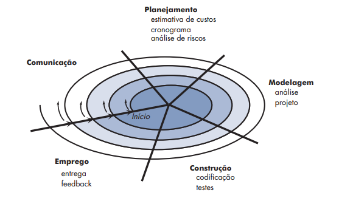

# Questões

## Questão 1

*Ano: 2021 Banca: VUNESP Órgão: TJM-SP Prova: VUNESP - 2021 - TJM-SP - Técnico em Comunicação e Processamento de Dados Judiciário (Desenvolvedor)*

O modelo de desenvolvimento de software RAD (Rapid Application Development) conta com uma fase de Modelagem, que compreende a modelagem de 

Alternativas:

A. Negócio, Dados e Processo

B. Teste, Integração e Negócio

C. Protótipo, Entrega e Dados

D. Comunicação, Integração e Teste

E. Entrega, Comunicação e Protótipo

### Comentário

O modelo de desenvolvimento RAD, criado por James Martin, em 1991, é incremental, sequencial e linear. O uso e o reuso de componentes e a produção automatizada de software são aspectos importantes dessa abordagem. No RAD, o processo consiste em: modelagem de negócio, modelagem dos dados, modelagem do processo, geração da aplicação, teste e modificação. **Gabarito: A**

Referências: [O que é RAD - Rapid Application Development?](https://www.treinaweb.com.br/blog/o-que-e-rad-rapid-application-development) e [Unidade 1 - Modelo de Processo: RAD](http://www2.dc.ufscar.br/~lapes/ead/ES-Sandra/Material/Material%20final%20-%20para%20Mindomo/Unidade%201/Unidade%201%20-%20RAD.pdf)

## Questão 2

*Ano: 2021 Banca: VUNESP Órgão: TJM-SP Prova: VUNESP - 2021 - TJM-SP - Técnico em Comunicação e Processamento de Dados Judiciário (Desenvolvedor)*

Algumas atividades que fazem parte do modelo espiral de desenvolvimento de software são: Construção – Implantação – Comunicação – Planejamento – Modelagem                               

A ordem correta com que tais atividades são executadas, considerando o modelo espiral, é: 

Alternativas:

A. Comunicação, Planejamento, Modelagem, Construção e Implantação.

B. Construção, Implantação, Comunicação, Modelagem e Planejamento.

C. Modelagem, Planejamento, Construção, Implantação e Comunicação.

D. Planejamento, Construção, Implantação, Comunicação e Modelagem.

E. Planejamento, Modelagem, Comunicação, Construção e Implantação.

### Comentário

O modelo espiral combina aspectos dos processos iterativos e em cascata. O desenvolvimento do software passa por uma série de evoluções, que têm as etapas: Comunicação, Planejamento, Modelagem, Construção e Implantação (ou Emprego). A cada iteração, fazem-se ajustes de custo e cronograma, bem como se reavaliam os riscos. **Gabarito: A**

Referência: Presman, R. S. Engenharia de software: uma abordagem profissional, 7ª ed., p. 65-66.